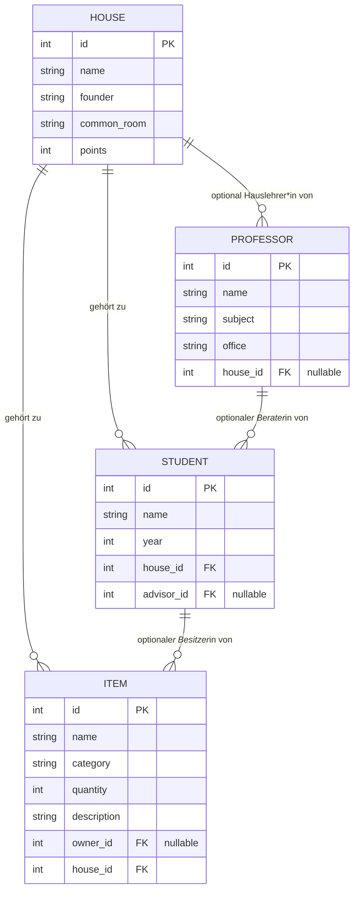

# Dokumentation — Hogwarts Inventory

Sarah Prante, Rocio Sainz
Agile Webanwendung mit Python
WiSe 2025/2026
https://github.com/tac0rosa/Hogwarts-Inventory

> Dieses Dokument wird im Laufe der Entwicklung nach und nach vervollständigt (siehe Abschnitt "Documentation" in `TASKS.md`), nicht alles auf einmal am Ende.

## 1. Motivation und Anforderungen

### 1.1 Projektidee

Die Idee zu Hogwarts Inventory ist aus unserer gemeinsamen Begeisterung für Harry Potter entstanden. Anstatt eine thematisch neutrale, "langweilige" Inventarverwaltung zu bauen, wollten wir ein Thema wählen, das uns beide während der Entwicklung motiviert und mit dessen Figuren, Orten und Regeln wir uns ohnehin gut auskennen. Im Kern ist Hogwarts Inventory eine klassische CRUD-Anwendung zur Verwaltung von Datensätzen mit Beziehungen untereinander — nur eben verpackt in die Welt von Hogwarts, der Schule für Hexerei und Zauberei, statt in ein generisches Firmen- oder Lagerbeispiel.

### 1.2 Ideensammlung

Wir haben uns auf vier zusammenhängende Entitäten festgelegt: Häuser, Professor\*innen, Schüler\*innen und Gegenstände. Ein Haus hat Professor\*innen und Schüler\*innen, Schüler\*innen haben optional eine\*n Berater\*in, und Gegenstände gehören zu einem Haus und optional einer\*einem Schüler\*in. Damit ergibt sich ein kleines, aber vollständiges Beziehungsgeflecht, an dem sich CRUD-Operationen über mehrere verknüpfte Modelle hinweg sinnvoll zeigen lassen.

### 1.3 Anforderungen an das Projekt

Hogwarts Inventory soll die vollständige Verwaltung (Anlegen, Anzeigen, Bearbeiten, Löschen) von vier Datentypen ermöglichen:

- **Houses**: Name, Gründer\*in, Gemeinschaftsraum, Hauspunkte.
- **Professors**: Name, unterrichtetes Fach, Büro, optional das Haus, dessen Hauslehrer\*in sie/er ist.
- **Students**: Name, Jahrgangsstufe, zugehöriges Haus (Pflicht), optional ein\*e Professor\*in als Berater\*in.
- **Items**: Name, Kategorie, Menge, Beschreibung, verpflichtend zugehöriges Haus, optional eine\*n Besitzer\*in (Student).

Dabei soll jede Entität sowohl über das automatisch generierte Django-Admin-Interface als auch über eigene, selbst gestaltete Views und Templates verwaltbar sein — Nutzer\*innen der Anwendung sollen also nicht zwingend auf das Admin-Interface angewiesen sein. Löschregeln sollen die Datenintegrität sicherstellen (z. B. werden Gegenstände eines Hauses mitgelöscht, wenn das Haus gelöscht wird). Die Anwendung soll lokal mit einer SQLite-Datenbank lauffähig sein, ohne zusätzliche Infrastruktur.

### 1.4 Recherchen und bestehende Lösungen

Eine direkte Konkurrenz zu einer Verwaltungsanwendung für eine fiktive Zauberschule gibt es naturgemäß nicht — hier lohnt sich die Recherche eher auf Ebene der beiden realen Konzepte, die hinter Hogwarts Inventory stecken: Schulverwaltungssoftware und Inventar-/Asset-Tracking.

Im Bereich Schulverwaltung mit Django sind wir unter anderem auf [Django-SIS](https://github.com/burke-software/schooldriver) gestoßen, ein quelloffenes School Information System, das bewusst stark auf das Django-Admin-Interface setzt, um Schüler\*innen-, Eltern- und Lehrer\*innendaten zu verwalten. Das deckt sich mit unserem eigenen Ansatz, admin.py von Anfang an vollständig zu pflegen und die eigenen CRUD-Views quasi als "hübschere" Oberfläche über denselben Daten zu bauen. Daneben gibt es diverse kleinere [Django School Management Systeme](https://github.com/topics/school-management-system) auf GitHub, die im Kern dieselben Grundoperationen (Schüler\*innen, Lehrkräfte, Klassen/Kurse verwalten) abdecken wie unsere Students/Professors-Verwaltung.

Für den Items-Teil ist die naheliegende reale Kategorie Asset- bzw. Inventarverwaltungssoftware wie [Sortly](https://www.sortly.com/) oder [Asset Panda](https://www.assetpanda.com/), die Gegenstände mit Menge, Kategorie und Zuordnung zu einem Ort oder einer Person verwalten — strukturell sehr ähnlich zu unserem Item-Modell (Menge, Kategorie, zugehöriges Haus, optionale\*r Besitzer\*in), nur eben für reale statt magische Gegenstände.

Quellen zu diesem Abschnitt sind auch in Abschnitt 6 (Quellen) aufgeführt.

## 2. Planung und Design

### 2.1 Team, Aufgabenteilung und Zusammenarbeit

Das Team besteht aus Sarah Prante und Rocio Sainz. Abgestimmt haben wir uns sowohl persönlich als auch über Discord. Code und Dokumentation entstehen bei uns gemeinsam — beide arbeiten an beidem mit, es gibt aber eine leichte Schwerpunktverteilung: Sarah legt etwas mehr Fokus auf Design und die laufende Dokumentation, Rocio etwas mehr auf die Programmierung. Über `git` und GitHub bleibt für beide jederzeit nachvollziehbar, wer welchen Teil zuletzt bearbeitet hat.

### 2.2 Gewählte Technologien

**Django**
Als Web-Framework verwenden wir Django (Python), das im Rahmen des Moduls vorgegeben ist. Django bringt mit dem integrierten Admin-Interface, dem ORM und den ModelForms bereits vieles mit, was für eine CRUD-lastige Anwendung wie diese direkt gebraucht wird, ohne dass wir Authentifizierung, Formularvalidierung oder Datenbankzugriff von Grund auf selbst schreiben müssen.

**Python 3.12**
Als Interpreter-Version nutzen wir Python 3.12, kompatibel mit der in `requirements.txt` festgelegten Django-Version. (Die konkrete Geschichte dazu, warum das nicht von Anfang an die naheliegendste Wahl war, steht in Abschnitt 3.3.)

**SQLite**
Als Datenbank kommt SQLite zum Einsatz, Djangos Standarddatenbank ohne separate Serverinstallation — für ein Projekt dieser Größe reicht das aus, und jede\*r kann das Projekt lokal starten, ohne vorher eine Datenbank aufsetzen zu müssen.

**Git & GitHub**
Zur Versionskontrolle und für die Zusammenarbeit am Code nutzen wir Git mit einem gemeinsamen Repository auf GitHub.

**Visual Studio Code**
Als Editor verwenden wir beide VS Code.

### 2.3 Datenbankstruktur

## 3. Entwicklung

_TODO: Beschreibung der Funktionalitäten (mit Screenshots) und technische Herausforderungen (mit Codeausschnitten). Ein Abschnitt pro CRUD-Bereich (Houses, Professors, Students, Items)._

### Houses

### Professors

### Students

### Items

## 4. Inbetriebnahme

_TODO: Schritte zur lokalen Inbetriebnahme des Projekts (siehe auch `README.md`)._

## 5. Fazit

_TODO: welche ursprünglichen Anforderungen umgesetzt wurden, persönliche Einschätzung, mögliche Erweiterungen oder zukünftige Verbesserungen._

## 6. Quellen

_Wird laufend ergänzt._

- https://github.com/burke-software/schooldriver — Django-SIS, School Information System (Recherche Abschnitt 1.4)
- https://github.com/topics/school-management-system — weitere Django School Management Systeme (Recherche Abschnitt 1.4)
- https://www.sortly.com/ — Asset-/Inventarverwaltung, Vergleich für Items (Recherche Abschnitt 1.4)
- https://www.assetpanda.com/ — Asset-/Inventarverwaltung, Vergleich für Items (Recherche Abschnitt 1.4)
