# Dokumentation — Hogwarts Inventory

Sarah Prante, Rocio Sainz
Agile Webanwendung mit Python
WiSe 2025/2026
https://github.com/tac0rosa/Hogwarts-Inventory

## 1. Motivation und Anforderungen

### 1.1 Projektidee

Die Idee zu Hogwarts Inventory ist aus unserer gemeinsamen Begeisterung für Harry Potter entstanden. Anstatt eine thematisch neutrale, "langweilige" Inventarverwaltung zu bauen, wollten wir ein Thema wählen, das uns beide während der Entwicklung motiviert und mit dessen Figuren, Orten und Regeln wir uns ohnehin gut auskennen. Im Kern ist Hogwarts Inventory eine klassische CRUD-Anwendung zur Verwaltung von Datensätzen mit Beziehungen untereinander — nur eben verpackt in die Welt von Hogwarts, der Schule für Hexerei und Zauberei, statt in ein generisches Firmen- oder Lagerbeispiel.

### 1.2 Ideensammlung

Wir haben uns auf vier zusammenhängende Entitäten festgelegt: Häuser, Professor\*innen, Schüler\*innen und Gegenstände. Ein Haus hat Professor\*innen und Schüler\*innen, Schüler\*innen haben optional eine\*n Berater\*in, und Gegenstände gehören zu einem Haus und optional einer\*einem Schüler\*in. Damit ergibt sich ein kleines, aber vollständiges Beziehungsgeflecht, an dem sich CRUD-Operationen über mehrere verknüpfte Modelle hinweg sinnvoll zeigen lassen.

### 1.3 Anforderungen an das Projekt

Hogwarts Inventory soll die vollständige Verwaltung (Anlegen, Anzeigen, Bearbeiten, Löschen) von vier Datentypen ermöglichen:

- **Houses**: Name, Gründer\*in, Gemeinschaftsraum, Hauspunkte.
- **Professors**: Name, unterrichtetes Fach, Büro, optional das Haus, dessen Hauslehrer\*in sie/er ist.
- **Students**: Name, Jahrgangsstufe, zugehöriges Haus (Pflicht), optional ein\*e Professor\*in als Berater\*in.
- **Items**: Name, Kategorie, Menge, Beschreibung, verpflichtend zugehöriges Haus, optional eine\*n Besitzer\*in (Student).

Dabei soll jede Entität sowohl über das automatisch generierte Django-Admin-Interface als auch über eigene, selbst gestaltete Views und Templates verwaltbar sein — Nutzer\*innen der Anwendung sollen also nicht zwingend auf das Admin-Interface angewiesen sein. Löschregeln sollen die Datenintegrität sicherstellen (z. B. werden Gegenstände eines Hauses mitgelöscht, wenn das Haus gelöscht wird). Die Anwendung soll lokal mit einer SQLite-Datenbank lauffähig sein, ohne zusätzliche Infrastruktur.

### 1.4 Recherchen und bestehende Lösungen

Eine direkte Konkurrenz zu einer Verwaltungsanwendung für eine fiktive Zauberschule gibt es naturgemäß nicht — hier lohnt sich die Recherche eher auf Ebene der beiden realen Konzepte, die hinter Hogwarts Inventory stecken: Schulverwaltungssoftware und Inventar-/Asset-Tracking.

Im Bereich Schulverwaltung mit Django sind wir unter anderem auf [Django-SIS](https://github.com/burke-software/schooldriver) gestoßen, ein quelloffenes School Information System, das bewusst stark auf das Django-Admin-Interface setzt, um Schüler\*innen-, Eltern- und Lehrer\*innendaten zu verwalten. Das deckt sich mit unserem eigenen Ansatz, admin.py von Anfang an vollständig zu pflegen und die eigenen CRUD-Views quasi als "hübschere" Oberfläche über denselben Daten zu bauen. Daneben gibt es diverse kleinere [Django School Management Systeme](https://github.com/topics/school-management-system) auf GitHub, die im Kern dieselben Grundoperationen (Schüler\*innen, Lehrkräfte, Klassen/Kurse verwalten) abdecken wie unsere Students/Professors-Verwaltung.

Für den Items-Teil ist die naheliegende reale Kategorie Asset- bzw. Inventarverwaltungssoftware wie [Sortly](https://www.sortly.com/) oder [Asset Panda](https://www.assetpanda.com/), die Gegenstände mit Menge, Kategorie und Zuordnung zu einem Ort oder einer Person verwalten — strukturell sehr ähnlich zu unserem Item-Modell (Menge, Kategorie, zugehöriges Haus, optionale\*r Besitzer\*in), nur eben für reale statt magische Gegenstände.

Quellen zu diesem Abschnitt sind auch in Abschnitt 6 (Quellen) aufgeführt.

## 2. Planung und Design

### 2.1 Team, Aufgabenteilung und Zusammenarbeit

Das Team besteht aus Sarah Prante und Rocio Sainz. Abgestimmt haben wir uns sowohl persönlich als auch über Discord. Code und Dokumentation entstehen bei uns gemeinsam — beide arbeiten an beidem mit, es gibt aber eine leichte Schwerpunktverteilung: Sarah legt etwas mehr Fokus auf Design und die laufende Dokumentation, Rocio etwas mehr auf die Programmierung. Über `git` und GitHub bleibt für beide jederzeit nachvollziehbar, wer welchen Teil zuletzt bearbeitet hat.

### 2.2 Gewählte Technologien

**Django**
Als Web-Framework verwenden wir Django (Python), das im Rahmen des Moduls vorgegeben ist. Django bringt mit dem integrierten Admin-Interface, dem ORM und den ModelForms bereits vieles mit, was für eine CRUD-lastige Anwendung wie diese direkt gebraucht wird, ohne dass wir Authentifizierung, Formularvalidierung oder Datenbankzugriff von Grund auf selbst schreiben müssen.

**Python 3.12**
Als Interpreter-Version nutzen wir Python 3.12, kompatibel mit der in `requirements.txt` festgelegten Django-Version. (Die konkrete Geschichte dazu, warum das nicht von Anfang an die naheliegendste Wahl war, steht in Abschnitt 3.1.)

**SQLite**
Als Datenbank kommt SQLite zum Einsatz, Djangos Standarddatenbank ohne separate Serverinstallation — für ein Projekt dieser Größe reicht das aus, und jede\*r kann das Projekt lokal starten, ohne vorher eine Datenbank aufsetzen zu müssen.

**Git & GitHub**
Zur Versionskontrolle und für die Zusammenarbeit am Code nutzen wir Git mit einem gemeinsamen Repository auf GitHub.

**Visual Studio Code**
Als Editor verwenden wir beide VS Code.

### 2.3 Datenbankstruktur

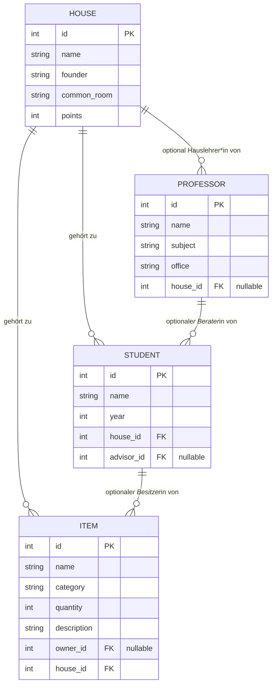

## 3. Entwicklung

### 3.1 Umgebung: Python- und Django-Version

Bevor überhaupt ein Modell existierte, gab es schon die erste technische Hürde: Das virtuelle Environment war zunächst mit Python 3.14 aufgesetzt, der zu dem Zeitpunkt aktuellsten Version. Django 4.2 — die im Modul vorgegebene Version — unterstützt Python 3.14 aber (noch) nicht; beim Ausführen von `pip install -r requirements.txt` bzw. beim ersten `manage.py check` kam es zu Fehlern, die sich auf inkompatible Python-Interna zurückführen ließen. Die Alternative wäre gewesen, statt Python herunterzustufen einfach auf eine neuere, mit Python 3.14 kompatible Django-Version zu wechseln — das hätte aber bedeutet, von der im Modul vorgegebenen und in `requirements.txt` festgelegten Django 4.2 abzuweichen, nur um ein lokales Versionsproblem zu lösen. Der pragmatischere Weg war daher, das `.venv` mit Python 3.12 neu aufzusetzen, einer Version, die von Django 4.2 offiziell unterstützt wird. Seitdem läuft die Umgebung stabil; die Lehre daraus war, vor dem Anlegen eines Environments kurz die Kompatibilitätsmatrix des vorgegebenen Frameworks zu prüfen, statt automatisch die neueste Interpreter-Version zu nehmen.

### 3.2 Houses

**Funktionalität**

Houses ist der erste vollständig umgesetzte CRUD-Bereich und damit auch die Vorlage für alle weiteren Entitäten. Über `/houses/` gelangt man zu einer Listenansicht aller Häuser mit Name, Gründer\*in und Punkten; ein Klick auf den Namen führt zur Detailansicht mit allen Feldern (inklusive Gemeinschaftsraum). Von dort aus lassen sich Häuser anlegen (`/houses/new/`), bearbeiten (`/houses/<pk>/edit/`) und löschen (`/houses/<pk>/delete/`), jeweils über ein eigenes Formular bzw. eine Sicherheitsabfrage vor dem Löschen. Zusätzlich sind alle vier Häuser weiterhin vollständig über das Django-Admin-Interface verwaltbar, da `House` in `inventory/admin.py` registriert ist — die eigenen Views sind also eine zusätzliche, aber keine zwingende Oberfläche.

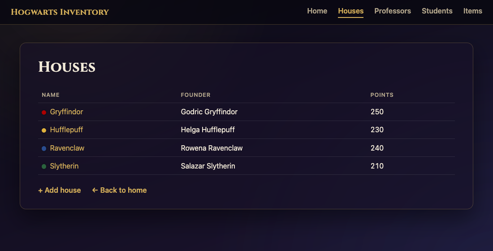

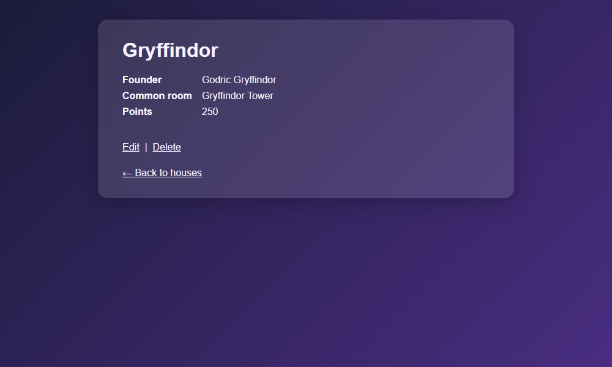

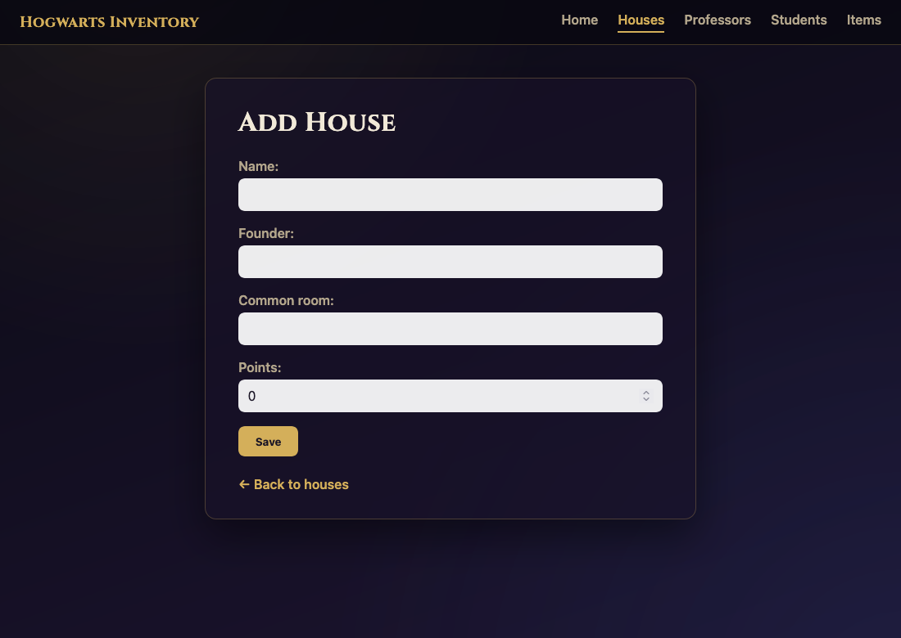

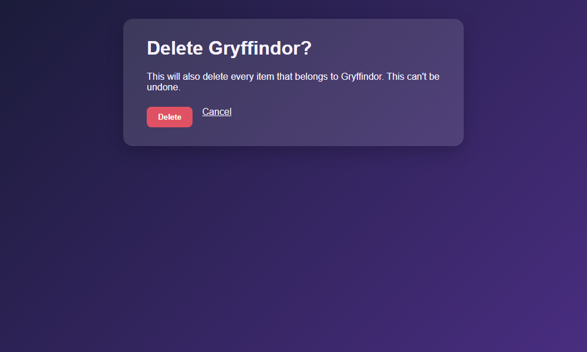

Technisch stehen hinter den fünf URLs fünf schlanke, generische Class-Based Views (`ListView`, `DetailView`, `CreateView`, `UpdateView`, `DeleteView`), die jeweils nur Modell, Template und ggf. Formularklasse angeben müssen:

```python
class HouseCreateView(CreateView):
    model = House
    form_class = HouseForm
    template_name = 'inventory/house_form.html'
    success_url = reverse_lazy('house_list')


class HouseUpdateView(UpdateView):
    model = House
    form_class = HouseForm
    template_name = 'inventory/house_form.html'

    def get_success_url(self):
        return reverse_lazy('house_detail', kwargs={'pk': self.object.pk})
```

Create- und Update-View teilen sich bewusst dasselbe Template `house_form.html` und dieselbe `ModelForm` (`HouseForm`); das Template unterscheidet Anlegen und Bearbeiten nur über die Existenz von `house` im Kontext (`Edit …Add House`).

**Technische Herausforderung**

Anforderung 1.3 verlangt, dass beim Löschen eines Hauses auch dessen Items automatisch mitgelöscht werden, um die Datenintegrität zu sichern. Im ursprünglichen Modell war `Item.house` — wie `Item.owner` — als `null=True, blank=True` mit `on_delete=SET_NULL` angelegt, weil das beim ersten Entwurf aller vier Modelle in einem Rutsch einfacher zu tippen war. Das widerspricht aber der eigenen Anforderung: Ein Item ohne Haus soll es laut Spezifikation gar nicht geben, und beim Löschen eines Hauses sollten dessen Items verschwinden statt "herrenlos" mit `house = NULL` liegen zu bleiben. Die Korrektur war eine kleine, aber inhaltlich wichtige Migration:

```python
# inventory/migrations/0002_alter_item_house.py
migrations.AlterField(
    model_name='item',
    name='house',
    field=models.ForeignKey(
        on_delete=django.db.models.deletion.CASCADE,
        related_name='items',
        to='inventory.house',
    ),
)
```

`house` ist damit ein Pflichtfeld ohne `null=True` geworden, und `on_delete` wechselt von `SET_NULL` auf `CASCADE`. Sichtbar wird das in der Löschbestätigung (`house_confirm_delete.html`), die explizit warnt: *"This will also delete every item that belongs to {{ house.name }}."* Die Migration wurde nachträglich in den bereits laufenden Houses-Zweig eingefügt (Commit *"Require a house on every Item"*), statt sie erst bei den Items-Views nachzuholen — Löschregeln, die eine andere Entität betreffen, gehören inhaltlich zu der Entität, die sie auslöst.

### 3.3 Professors

**Funktionalität**

Professors folgt exakt demselben Muster wie Houses: Liste unter `/professors/` (Name, Fach, Büro, ggf. Haus, dessen Hauslehrer\*in die Person ist), Detailansicht, sowie Anlegen/Bearbeiten/Löschen unter `/professors/new/`, `/professors/<pk>/edit/` und `/professors/<pk>/delete/`. Der inhaltliche Unterschied zu Houses liegt im `house`-Feld: Es ist optional (`null=True, blank=True`), da nicht jede\*r Professor\*in zwangsläufig Hauslehrer\*in ist. In der Liste wird ein fehlendes Haus als "—" dargestellt (`{{ professor.house.name|default:"—" }}`), im Anlege-/Bearbeitungsformular erscheint das Feld als Dropdown mit einer leeren Option, ergänzt um den in `models.py` hinterlegten `help_text`.

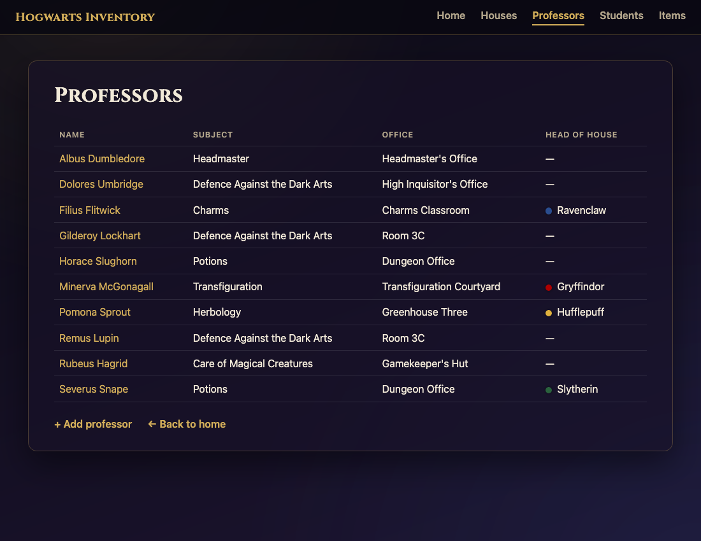

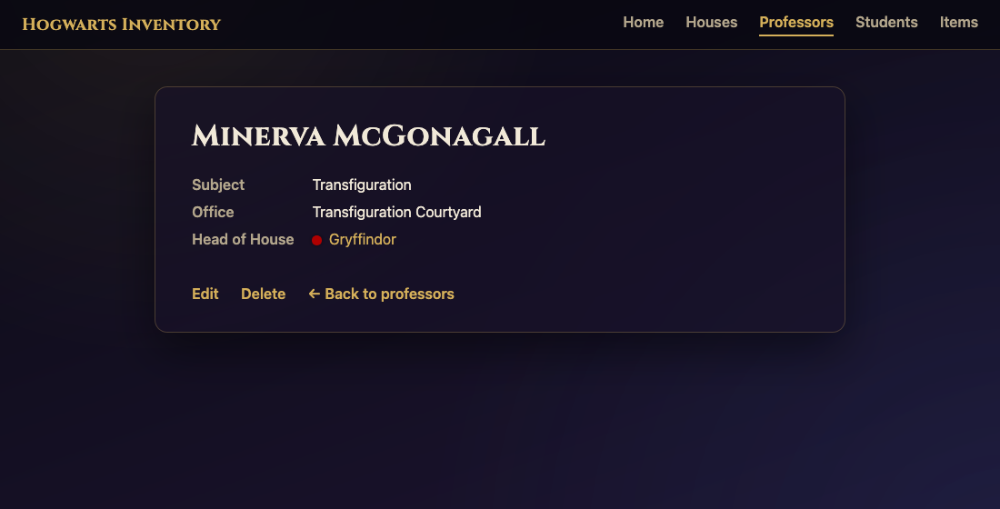

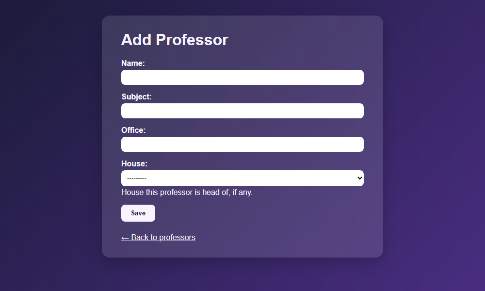

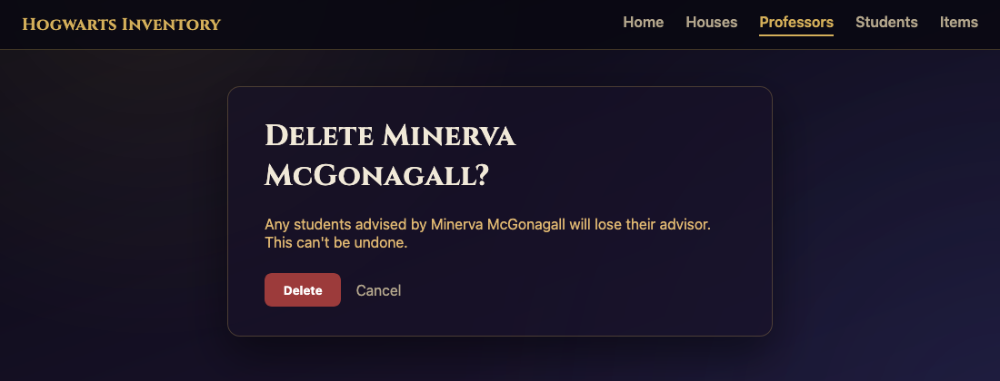

**Technische Herausforderung**

Der interessante Teil war weniger der CRUD-Code selbst — der ist dank des in 3.2 etablierten Musters (generische Views + `ModelForm`) fast mechanisch — sondern die Frage, wie sich ein optionales Fremdschlüsselfeld korrekt über alle Ebenen hinweg (Modell, Formular, Templates) durchzieht, ohne dass an einer Stelle stillschweigend ein Pflichtfeld daraus wird:

```python
class Professor(models.Model):
    ...
    house = models.ForeignKey(
        House,
        on_delete=models.SET_NULL,
        null=True,
        blank=True,
        related_name='professors',
        help_text="House this professor is head of, if any.",
    )
```

`null=True` erlaubt `NULL` in der Datenbank, `blank=True` erlaubt ein leeres Feld im Formular — beides zusammen ist nötig, sonst verlangt entweder die Datenbank oder Djangos Formularvalidierung weiterhin ein Haus. Da `ProfessorForm` das Feld nicht anders anpasst, generiert `{{ form.as_p }}` daraus automatisch ein `<select>` mit einer leeren Erstoption, exakt wie im Screenshot oben zu sehen. Beim Löschen eines Hauses, das Hauslehrer\*in für eine\*n Professor\*in ist, greift entsprechend `on_delete=SET_NULL`: Der\*die Professor\*in bleibt bestehen, verliert aber die Zuordnung — anders als bei Items, die beim Löschen ihres Hauses mitgelöscht werden (siehe 3.2). Diese bewusst unterschiedliche Löschstrategie pro Beziehung war ein guter Anlass, `on_delete`-Optionen nicht pauschal, sondern pro Feld anhand der fachlichen Anforderung zu wählen.

### 3.4 Students

**Funktionalität**

Students folgt dem in 3.2 und 3.3 etablierten Muster: Liste unter `/students/` (Name, Jahrgangsstufe, Haus, Berater\*in), Detailansicht, sowie Anlegen/Bearbeiten/Löschen unter `/students/new/`, `/students/<pk>/edit/` und `/students/<pk>/delete/`. Anders als bei Houses und Professors hat `Student` zwei Fremdschlüsselfelder gleichzeitig, mit jeweils unterschiedlicher fachlicher Bedeutung: `house` ist Pflicht (jede\*r Schüler\*in gehört zu genau einem Haus), `advisor` ist optional (nicht jede\*r hat eine\*n zugewiesene\*n Berater\*in). Im Formular erscheinen beide Felder automatisch als Dropdown, befüllt mit allen vorhandenen Häusern bzw. Professor\*innen — genau die in Anforderung 1.3 verlangte Darstellung "house/advisor als Dropdowns".

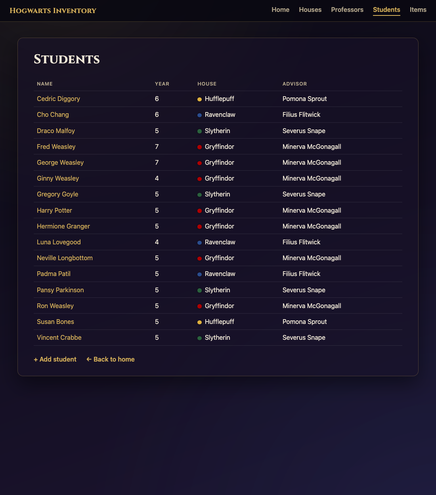

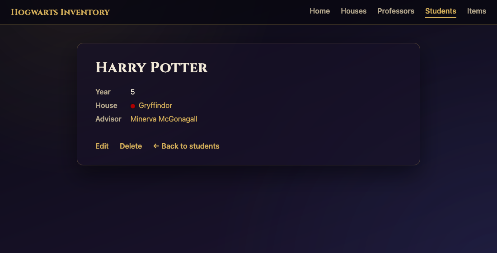

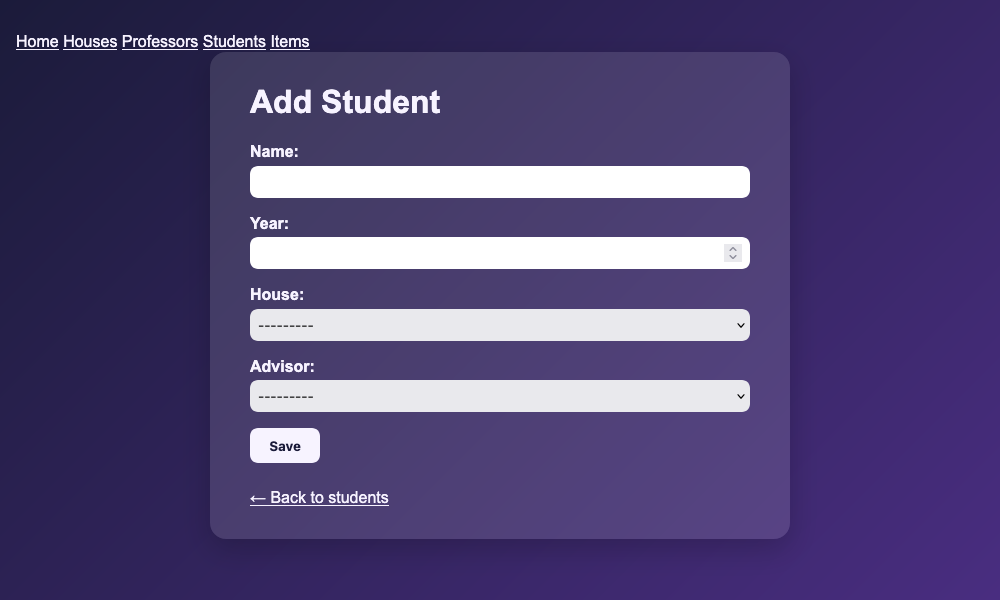

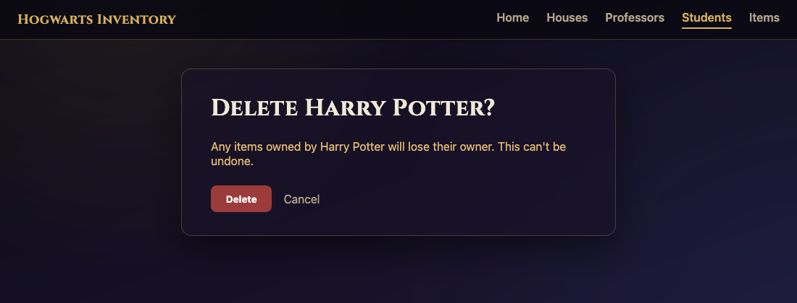

```python
class Student(models.Model):
    name = models.CharField(max_length=100)
    year = models.PositiveSmallIntegerField()
    house = models.ForeignKey(
        House,
        on_delete=models.CASCADE,
        related_name='students',
    )
    advisor = models.ForeignKey(
        Professor,
        on_delete=models.SET_NULL,
        null=True,
        blank=True,
        related_name='advisees',
    )
```

**Technische Herausforderung**

Die eigentliche Herausforderung bei Students war weniger das CRUD-Gerüst selbst, sondern die Frage, wie zwei Fremdschlüsselfelder auf demselben Modell trotz unterschiedlicher Lösch- und Pflichtsemantik beide korrekt als Dropdown im selben Formular landen, ohne eigene Formularlogik schreiben zu müssen. `StudentForm` deklariert dazu nichts weiter als die Feldliste:

```python
class StudentForm(forms.ModelForm):
    class Meta:
        model = Student
        fields = ['name', 'year', 'house', 'advisor']
```

Django leitet aus `null=True`/`blank=True` bzw. deren Fehlen automatisch ab, ob das jeweilige `<select>` eine leere Erstoption bekommt und ob das Feld im Formular als Pflichtfeld validiert wird — bei `house` nicht, bei `advisor` schon. Beim Löschen eines Hauses greift entsprechend `on_delete=CASCADE`: Da ein Haus für eine\*n Schüler\*in zwingend ist, kann sie\*er nicht "herrenlos" ohne Haus existieren, weshalb Löschung des Hauses konsequenterweise auch die betroffenen Schüler\*innen mitlöscht — ebenso wie bei Items (3.2). Beim Löschen einer\*eines Professor\*in dagegen bleiben die Schüler\*innen bestehen (`on_delete=SET_NULL` auf `advisor`, siehe 3.3). Students ist damit das erste Modell im Projekt, an dem beide bereits etablierten Lösch-Strategien gleichzeitig sichtbar werden.

### 3.5 Items

**Funktionalität**

Items ist der letzte und zugleich am stärksten vernetzte CRUD-Bereich: Liste unter `/items/` (Name, Kategorie, Menge, Haus, Besitzer\*in), Detailansicht mit zusätzlicher Beschreibung, sowie Anlegen/Bearbeiten/Löschen unter `/items/new/`, `/items/<pk>/edit/` und `/items/<pk>/delete/`. Ein Item gehört verpflichtend zu einem Haus (siehe die in 3.2 nachträglich eingeführte `CASCADE`-Regel) und optional zu einer\*einem Besitzer\*in (`Student`). Da `description` ein `TextField` ist, generiert `{{ form.as_p }}` dafür automatisch eine mehrzeilige `<textarea>` statt eines einzeiligen Eingabefelds, ohne dass dafür etwas Zusätzliches in `ItemForm` konfiguriert werden musste.

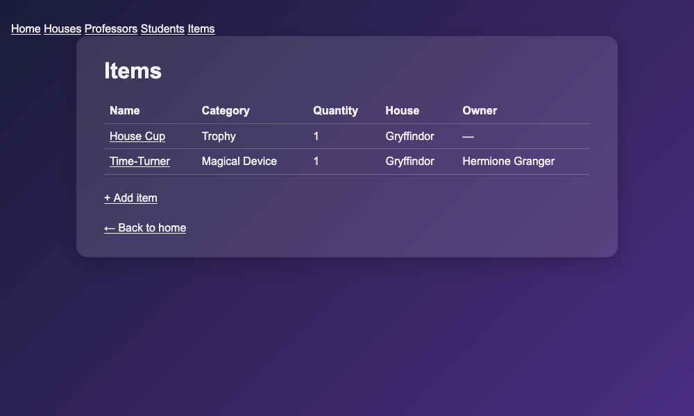

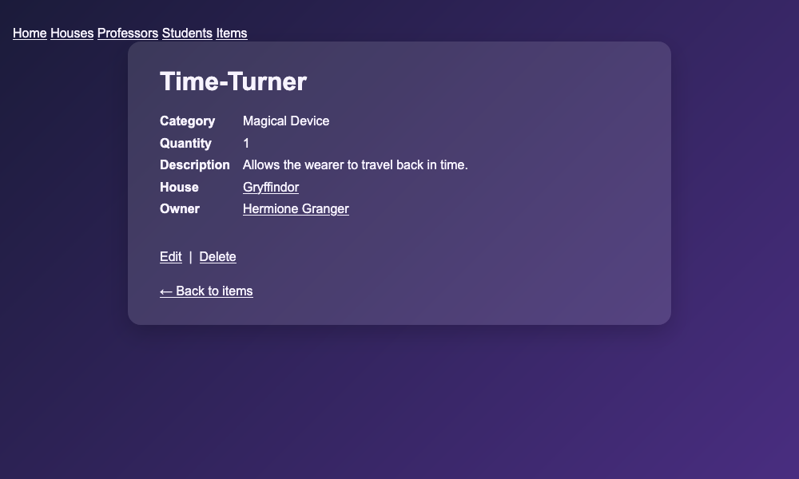

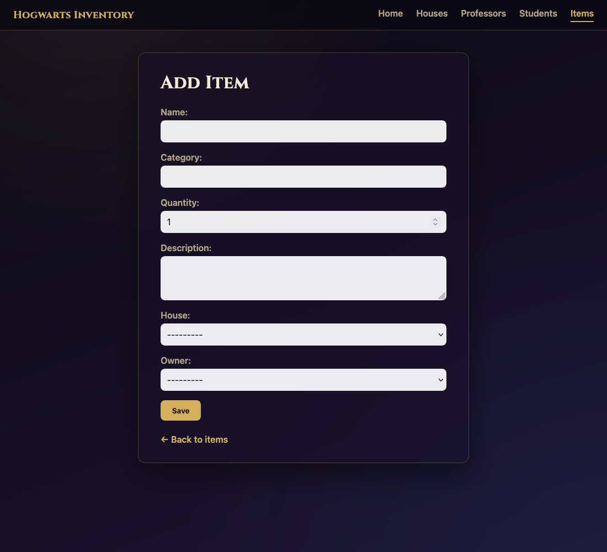

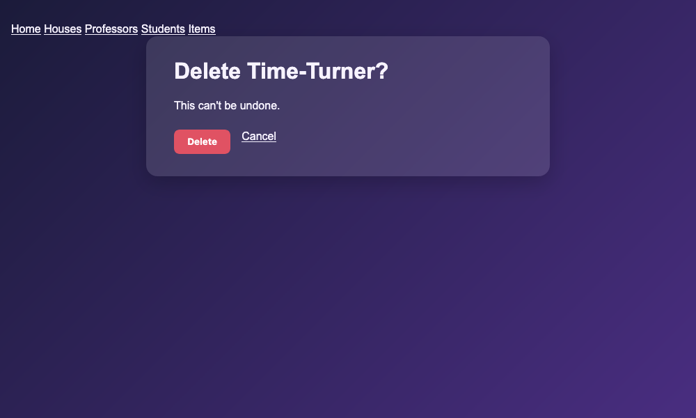

**Technische Herausforderung**

```python
class Item(models.Model):
    ...
    owner = models.ForeignKey(
        Student,
        on_delete=models.SET_NULL,
        null=True,
        blank=True,
        related_name='items',
    )
    house = models.ForeignKey(
        House,
        on_delete=models.CASCADE,
        related_name='items',
    )
```

Eine Einschränkung, die uns beim Testen aufgefallen ist und die wir bewusst nicht behoben haben, um den Rahmen des CRUD-Teils nicht zu sprengen: Das `owner`-Dropdown im Formular listet grundsätzlich alle Schüler\*innen, unabhängig vom im selben Formular gewählten `house`. Es ist also möglich, ein Item formal einem Haus zuzuordnen und gleichzeitig eine\*n Besitzer\*in aus einem anderen Haus einzutragen — Django validiert bei einem Standard-`ModelForm` nur, dass die referenzierte ID existiert, nicht aber fachliche Konsistenz zwischen zwei Fremdschlüsselfeldern desselben Formulars. Eine sauberere Lösung wäre eine eigene `clean()`-Methode auf `ItemForm`, die prüft, ob `owner.house == house` gilt, oder ein per JavaScript dynamisch gefiltertes Dropdown. Wir vermerken das hier bewusst als bekannte Grenze der aktuellen Implementierung statt es zu verschweigen (siehe auch Abschnitt 5, mögliche Erweiterungen).

## 4. Inbetriebnahme

Schritte zur Inbetriebnahme (auf einem lokalen Rechner):

1. Repository klonen: `git clone https://github.com/tac0rosa/Hogwarts-Inventory.git` und in den Ordner wechseln (`cd Hogwarts-Inventory`)
2. benötigte Programmiersprache: Python 3.12 (siehe 3.1)
3. virtuelle Umgebung anlegen und aktivieren: `python -m venv .venv`, danach `.venv\Scripts\activate` (Windows) bzw. `source .venv/bin/activate` (macOS/Linux)
4. Abhängigkeiten installieren: `pip install -r requirements.txt` (Django 4.2.30, Asgiref 3.11.1, Sqlparse 0.5.5, Typing_extensions 4.15.0, Versionen auch in `requirements.txt`)
5. Datenbank einrichten: `python manage.py migrate`
6. (optional) Beispieldaten laden: `python manage.py seed_movie_data` — befüllt Houses, Professors, Students und Items mit Daten basierend auf den Harry-Potter-Filmen (siehe `inventory/management/commands/seed_movie_data.py`); ohne diesen Schritt startet die Anwendung mit einer leeren Datenbank
7. Anwendung starten: `python manage.py runserver`
8. Browser öffnen und `http://127.0.0.1:8000/` besuchen (auf den Link im Terminal klicken); die Navigation oben auf jeder Seite führt zu allen vier Bereichen (`/houses/`, `/professors/`, `/students/`, `/items/`)

## 5. Fazit

### 5.1 Erfüllung der Anforderungen

Alle in Abschnitt 1.3 formulierten Anforderungen wurden vollständig umgesetzt: Für alle vier Entitäten (Houses, Professors, Students, Items) existiert vollständige CRUD-Funktionalität, jeweils sowohl über das Django-Admin-Interface als auch über eigene Views und Templates — Nutzer\*innen sind also nicht auf das Admin-Interface angewiesen. Die geforderten Löschregeln zur Sicherung der Datenintegrität sind über die `on_delete`-Optionen der jeweiligen Fremdschlüssel abgebildet: Items werden beim Löschen ihres Hauses automatisch mitgelöscht (`CASCADE`), während optionale Beziehungen wie Hauslehrer\*in oder Berater\*in beim Löschen des referenzierten Objekts lediglich auf `NULL` gesetzt werden (`SET_NULL`), siehe 3.2 und 3.3. Die Anwendung läuft wie gefordert lokal mit SQLite, ohne zusätzliche Infrastruktur (siehe 4). Offen ist zum jetzigen Stand nur Task 11 (Polish) — ein rein visueller Feinschliff von Navigation und Templates sowie ein README-Update —, der keine der ursprünglich gestellten funktionalen Anforderungen betrifft.

### 5.2 Persönlicher Eindruck

Insgesamt hat uns die Arbeit an Hogwarts Inventory Spaß gemacht. Da wir beide eher den Design-Schwerpunkt verfolgen und zuletzt vor allem an reinen Design-Projekten gearbeitet haben, war es eine willkommene Abwechslung, noch einmal ein tatsächliches Programmierprojekt umzusetzen und dabei unsere Programmierkenntnisse aus den ersten Semestern aufzufrischen. Vermutlich werden wir in Zukunft eher selten mit vergleichbaren Projekten zu tun haben, da uns beide der weitere Weg nicht in Richtung Softwareentwicklung führt — gerade deshalb war es schön, dieses Modul noch einmal bewusst dafür zu nutzen.

### 5.3 Erweiterungsmöglichkeiten

Über Task 11 hinaus ließe sich die Anwendung in mehrere Richtungen sinnvoll erweitern. Naheliegend wäre zunächst eine Such- und Filterfunktion in den Listenansichten (z. B. Items nach Kategorie oder Haus, Students nach Jahrgang), verbunden mit Pagination, sobald die Datenmengen wachsen — aktuell laden alle Listen ungefiltert und vollständig. Fachlich passend wäre außerdem eine kleine Rangliste bzw. ein Dashboard, das die vier Häuser nach Hauspunkten sortiert gegenüberstellt, ähnlich einer echten Hogwarts-Punktetafel. Sinnvoll wäre zudem eine Zugriffsbeschränkung: Aktuell sind sämtliche CRUD-Views ohne Anmeldung erreichbar; ein einfaches Login- bzw. Berechtigungssystem, bei dem nur angemeldete Nutzer\*innen bearbeiten oder löschen dürfen, wäre ein naheliegender nächster Schritt. Längerfristig denkbar sind außerdem Bild-Uploads (z. B. ein Foto pro Item oder ein Hauswappen) sowie automatisierte Tests, die aktuell komplett fehlen — bislang wird jede Änderung, wie in den Notizen zu `TASKS.md` festgehalten, nur manuell durchgeklickt.

## 6. Quellen

**Recherche zu bestehenden Lösungen (Abschnitt 1.4)**

- https://github.com/burke-software/schooldriver — Django-SIS, School Information System (Recherche Abschnitt 1.4)
- https://github.com/topics/school-management-system — weitere Django School Management Systeme (Recherche Abschnitt 1.4)
- https://www.sortly.com/ — Asset-/Inventarverwaltung, Vergleich für Items (Recherche Abschnitt 1.4)
- https://www.assetpanda.com/ — Asset-/Inventarverwaltung, Vergleich für Items (Recherche Abschnitt 1.4)

**Django-Dokumentation (verwendet während der gesamten Entwicklung)**

- https://docs.djangoproject.com/en/4.2/topics/class-based-views/generic-display/ — `ListView`/`DetailView`, Grundlage für alle Listen- und Detailansichten (Abschnitt 3.2–3.5)
- https://docs.djangoproject.com/en/4.2/topics/class-based-views/generic-editing/ — `CreateView`/`UpdateView`/`DeleteView`, Grundlage für alle Formular- und Löschviews (Abschnitt 3.2–3.5)
- https://docs.djangoproject.com/en/4.2/topics/forms/modelforms/ — `ModelForm`, insbesondere die automatische Dropdown-Generierung für Fremdschlüsselfelder (Abschnitt 3.3, 3.4)
- https://docs.djangoproject.com/en/4.2/ref/models/fields/#foreignkey — `on_delete`-Optionen (`CASCADE`, `SET_NULL`), zentral für die Löschregeln aus Anforderung 1.3 (Abschnitt 3.2, 3.3)
- https://docs.djangoproject.com/en/4.2/topics/migrations/ — Migrationen, u. a. für die nachträgliche Änderung von `Item.house` (Abschnitt 3.2)
- https://docs.djangoproject.com/en/4.2/ref/django-admin/#createsuperuser — Zugriff auf das Admin-Interface (Abschnitt 4)
- https://docs.djangoproject.com/en/4.2/howto/custom-management-commands/ — eigene `manage.py`-Befehle, Grundlage für `seed_movie_data` (Abschnitt 4)

**Sonstige Werkzeuge**

- https://mermaid.js.org/syntax/entityRelationshipDiagram.html — Syntax für das ER-Diagramm in Abschnitt 2.3

**Datenquelle für die Beispieldaten**

- https://harrypotter.fandom.com/ — Harry Potter Wiki, Referenz für Häuser, Professor\*innen, Schüler\*innen und Gegenstände aus den Filmen, verwendet zur Befüllung der Datenbank mit `seed_movie_data` (Abschnitt 4)
